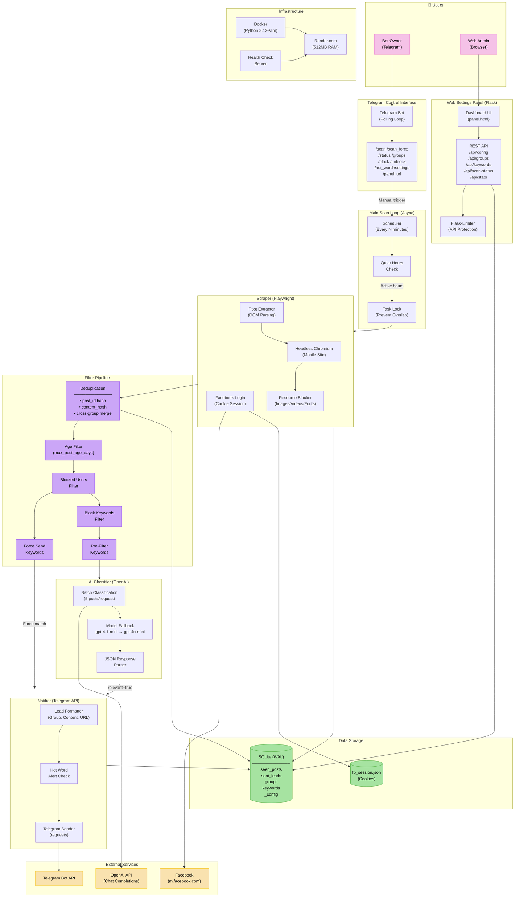
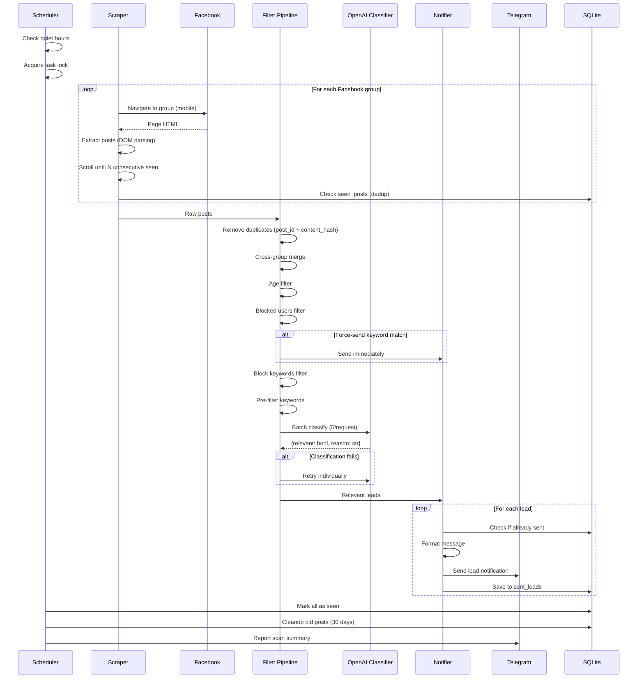
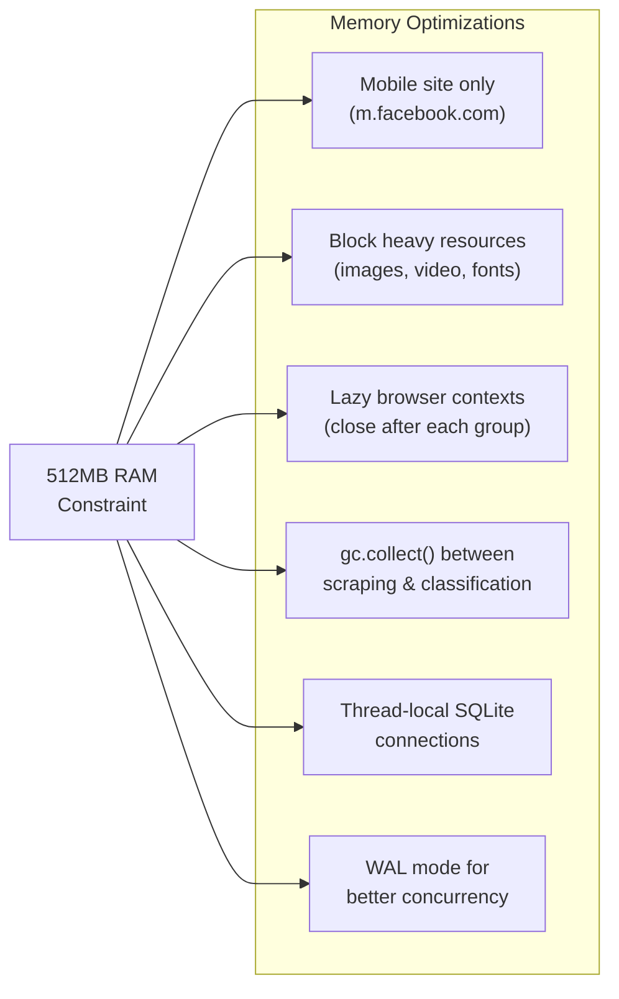

# Architecture Diagram - Facebook Leads Bot

## System Overview

```mermaid
graph TB
    subgraph Users["👥 Users"]
        Owner["Bot Owner<br/>(Telegram)"]
        WebAdmin["Web Admin<br/>(Browser)"]
    end

    subgraph TelegramControl["Telegram Control Interface"]
        TBot["Telegram Bot<br/>(Polling Loop)"]
        TCommands["/scan /scan_force<br/>/status /groups<br/>/block /unblock<br/>/hot_word /settings<br/>/panel_url"]
    end

    subgraph WebPanel["Web Settings Panel (Flask)"]
        PanelUI["Dashboard UI<br/>(panel.html)"]
        PanelAPI["REST API<br/>/api/config<br/>/api/groups<br/>/api/keywords<br/>/api/scan-status<br/>/api/stats"]
        RateLimiter["Flask-Limiter<br/>(API Protection)"]
    end

    subgraph MainLoop["Main Scan Loop (Async)"]
        Scheduler["Scheduler<br/>(Every N minutes)"]
        QuietHours["Quiet Hours<br/>Check"]
        TaskLock["Task Lock<br/>(Prevent Overlap)"]
    end

    subgraph Scraper["Scraper (Playwright)"]
        Browser["Headless Chromium<br/>(Mobile Site)"]
        Login["Facebook Login<br/>(Cookie Session)"]
        PostExtractor["Post Extractor<br/>(DOM Parsing)"]
        ResourceBlocker["Resource Blocker<br/>(Images/Videos/Fonts)"]
    end

    subgraph FilterPipeline["Filter Pipeline"]
        Dedup["Deduplication<br/>─────────────<br/>• post_id hash<br/>• content_hash<br/>• cross-group merge"]
        AgeFilter["Age Filter<br/>(max_post_age_days)"]
        BlockedUsers["Blocked Users<br/>Filter"]
        ForceSend["Force Send<br/>Keywords"]
        BlockKeywords["Block Keywords<br/>Filter"]
        PreFilter["Pre-Filter<br/>Keywords"]
    end

    subgraph Classifier["AI Classifier (OpenAI)"]
        BatchClassify["Batch Classification<br/>(5 posts/request)"]
        ModelFallback["Model Fallback<br/>gpt-4.1-mini → gpt-4o-mini"]
        JSONParser["JSON Response<br/>Parser"]
    end

    subgraph Notifier["Notifier (Telegram API)"]
        LeadFormatter["Lead Formatter<br/>(Group, Content, URL)"]
        HotWordCheck["Hot Word<br/>Alert Check"]
        TelegramSender["Telegram Sender<br/>(requests)"]
    end

    subgraph Storage["Data Storage"]
        SQLite[("SQLite (WAL)<br/>─────────────<br/>seen_posts<br/>sent_leads<br/>groups<br/>keywords<br/>_config")]
        SessionFile[("fb_session.json<br/>(Cookies)")]
    end

    subgraph ExternalAPIs["External Services"]
        Facebook["Facebook<br/>(m.facebook.com)"]
        OpenAI["OpenAI API<br/>(Chat Completions)"]
        TelegramAPI["Telegram Bot API"]
    end

    subgraph Infra["Infrastructure"]
        Docker["Docker<br/>(Python 3.12-slim)"]
        Render["Render.com<br/>(512MB RAM)"]
        HealthCheck["Health Check<br/>Server"]
    end

    %% User interactions
    Owner --> TBot
    WebAdmin --> PanelUI

    %% Telegram control
    TBot --> TCommands
    TCommands -->|"Manual trigger"| Scheduler

    %% Web panel
    PanelUI --> PanelAPI
    PanelAPI --> RateLimiter
    PanelAPI --> SQLite

    %% Main loop
    Scheduler --> QuietHours
    QuietHours -->|"Active hours"| TaskLock
    TaskLock --> Scraper

    %% Scraping
    Browser --> ResourceBlocker
    Login --> Facebook
    Login --> SessionFile
    PostExtractor --> Browser

    %% Filter pipeline
    Scraper --> Dedup
    Dedup --> AgeFilter
    AgeFilter --> BlockedUsers
    BlockedUsers --> ForceSend
    ForceSend -->|"Force match"| Notifier
    BlockedUsers --> BlockKeywords
    BlockKeywords --> PreFilter
    PreFilter --> Classifier

    %% Classification
    BatchClassify --> OpenAI
    BatchClassify --> ModelFallback
    ModelFallback --> JSONParser
    JSONParser -->|"relevant=true"| Notifier

    %% Notification
    LeadFormatter --> HotWordCheck
    HotWordCheck --> TelegramSender
    TelegramSender --> TelegramAPI

    %% Storage
    Dedup --> SQLite
    Notifier --> SQLite
    Scraper --> SQLite

    %% Infrastructure
    Docker --> Render
    HealthCheck --> Render

    %% Styling
    classDef external fill:#f9e2af,stroke:#f5c211,color:#000
    classDef storage fill:#a6e3a1,stroke:#40a02b,color:#000
    classDef filter fill:#cba6f7,stroke:#8839ef,color:#000
    classDef user fill:#f5c2e7,stroke:#ea76cb,color:#000

    class Facebook,OpenAI,TelegramAPI external
    class SQLite,SessionFile storage
    class Dedup,AgeFilter,BlockedUsers,ForceSend,BlockKeywords,PreFilter filter
    class Owner,WebAdmin user
```

## Scan Cycle - Data Flow

```mermaid
sequenceDiagram
    participant S as Scheduler
    participant SC as Scraper
    participant FB as Facebook
    participant F as Filter Pipeline
    participant AI as OpenAI Classifier
    participant N as Notifier
    participant TG as Telegram
    participant DB as SQLite

    S->>S: Check quiet hours
    S->>S: Acquire task lock

    loop For each Facebook group
        SC->>FB: Navigate to group (mobile)
        FB-->>SC: Page HTML
        SC->>SC: Extract posts (DOM parsing)
        SC->>SC: Scroll until N consecutive seen
        SC->>DB: Check seen_posts (dedup)
    end

    SC->>F: Raw posts
    F->>F: Remove duplicates (post_id + content_hash)
    F->>F: Cross-group merge
    F->>F: Age filter
    F->>F: Blocked users filter

    alt Force-send keyword match
        F->>N: Send immediately
    end

    F->>F: Block keywords filter
    F->>F: Pre-filter keywords
    F->>AI: Batch classify (5/request)
    AI-->>F: {relevant: bool, reason: str}

    alt Classification fails
        F->>AI: Retry individually
    end

    F->>N: Relevant leads

    loop For each lead
        N->>DB: Check if already sent
        N->>N: Format message
        N->>TG: Send lead notification
        N->>DB: Save to sent_leads
    end

    S->>DB: Mark all as seen
    S->>DB: Cleanup old posts (30 days)
    S->>TG: Report scan summary
```

## Memory-Optimized Architecture (512MB)

```mermaid
graph LR
    subgraph Optimizations["Memory Optimizations"]
        A["Mobile site only<br/>(m.facebook.com)"]
        B["Block heavy resources<br/>(images, video, fonts)"]
        C["Lazy browser contexts<br/>(close after each group)"]
        D["gc.collect() between<br/>scraping & classification"]
        E["Thread-local SQLite<br/>connections"]
        F["WAL mode for<br/>better concurrency"]
    end

    RAM["512MB RAM<br/>Constraint"] --> A
    RAM --> B
    RAM --> C
    RAM --> D
    RAM --> E
    RAM --> F
```
